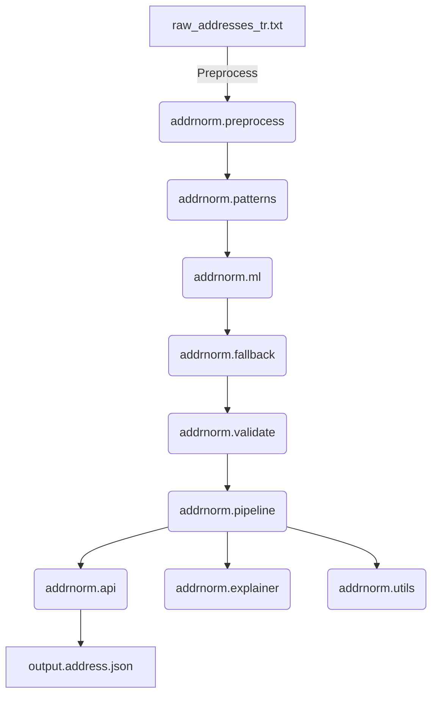

# Address Normalizer (addrnorm)

> Türkçe adresleri normalize eden, modüler Python monorepo.

## Mimarî (Mermaid)


## Hızlı Başlangıç
```bash
# Kurulum
make install

# Test
make test

# API'yi başlat
make run-api
```

## Örnek CLI Komutu
```bash
python -m src.addrnorm.preprocess.cli --input data/examples/raw_addresses_tr.txt --output data/examples/normalized.json
```

## Çıktı Şeması
- Bkz: `schemas/output.address.json`

## Lisans
MIT
