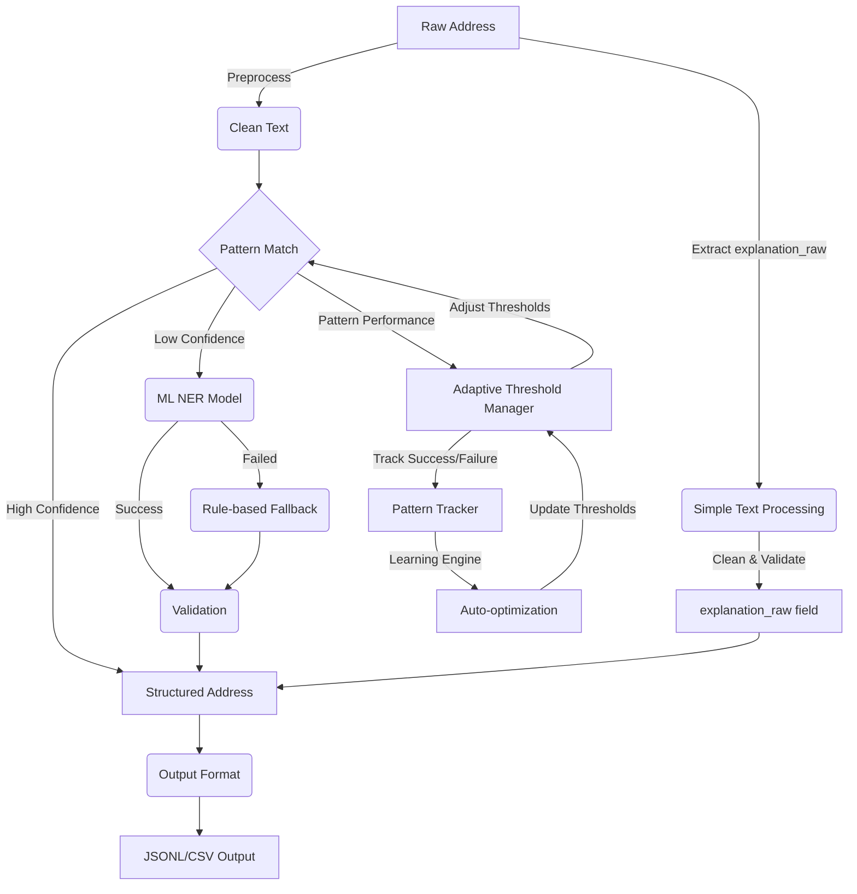

# Turkish Address Normalization Tool (addrnorm)

> Advanced Turkish address normalization using ML and rule-based methods with landmark explanation parsing and adaptive threshold management.

## Features

- **ML-powered NER**: spaCy-based named entity recognition (94.6% F-score)
- **Rule-based Fallback**: Pattern matching and heuristic extraction
- **Simple Explanation Processing**: Clean and validate explanation text for `explanation_raw` field
- **Adaptive Threshold Management**: Auto-adjust pattern thresholds based on performance
- **Geographic Validation**: 81 cities + 897 districts with fuzzy matching
- **Multiple Output Formats**: JSON Lines, CSV
- **Parallel Processing**: Batch processing with configurable concurrency
- **Command Line Interface**: Easy-to-use CLI with rich help and examples

## Architecture



## Quick Start

### Installation

```bash
# Clone repository
git clone https://github.com/merenert/PreprocessingV2.0
cd PreprocessingV2.0

# Install dependencies
pip install -r requirements.txt

# Install CLI tool
pip install -e .

# Alternative: Use batch wrapper (Windows)
# The included addrnorm.bat file provides direct CLI access
./addrnorm.bat --help
```

### Basic Usage

```bash
# Normalize a single address
addrnorm normalize --address "Atatürk Mahallesi Cumhuriyet Caddesi No:15 Çankaya/Ankara"

# Process a file of addresses
addrnorm normalize --in addresses.txt --out results.jsonl

# Export to CSV format
addrnorm normalize --in data.txt --out output.csv --format csv

# Parallel processing with metrics (note: currently runs sequentially due to ML model constraints)
addrnorm normalize --in large_file.txt --out results.jsonl --jobs 4 --metrics stats.json

# Alternative using Python module directly
python -m addrnorm.cli normalize --in addresses.txt --out results.jsonl
```

### Explanation Text Processing

```python
from addrnorm.explanation import process_explanation

# Simple text cleaning
cleaned = process_explanation("Migros yanı")
print(cleaned)  # "Migros yanı"

# Clean multiple explanations
examples = [
    "Amorium Hotel karşısı",
    "Şekerbank ATM yanında",
    "Koç Holding binası arkası"
]

for text in examples:
    cleaned = process_explanation(text)
    print(f"'{text}' → '{cleaned}'")
```
```

### Advanced Usage

```bash
# Show detailed help
addrnorm normalize --help

# Verbose output with processing details
addrnorm normalize --in data.txt --out results.jsonl --verbose --stats

# Custom ML model and thresholds
addrnorm normalize --in data.txt --out results.jsonl \
  --model-path custom_model \
  --pattern-threshold 0.9 \
  --ml-threshold 0.8

# Disable certain processing stages
addrnorm normalize --in data.txt --out results.jsonl --no-ml --no-validation

# Pretty print single address result
addrnorm normalize --address "Example address" --pretty
```

## Command Reference

### Global Commands

```bash
addrnorm --help              # Show help
addrnorm version             # Show version information
```

### Normalize Command

```bash
addrnorm normalize [OPTIONS]
```

#### Input Options

| Option | Description |
|--------|-------------|
| `--in FILE`, `--input FILE` | Input file containing addresses |
| `--address TEXT` | Single address to normalize |

#### Output Options

| Option | Description |
|--------|-------------|
| `--out FILE`, `--output FILE` | Output file path |
| `--format {jsonl,csv}` | Output format (default: jsonl) |
| `--pretty` | Pretty-print JSON (single address only) |

#### Processing Options

| Option | Description |
|--------|-------------|
| `--jobs N`, `-j N` | Number of parallel jobs (currently disabled) |
| `--batch-size N` | Batch size for processing (default: 100) |
| `--model-path PATH` | Path to ML model |
| `--no-ml` | Disable ML model |
| `--no-validation` | Disable geographic validation |

#### Threshold Configuration

| Option | Description |
|--------|-------------|
| `--pattern-threshold FLOAT` | Pattern matching threshold (default: 0.8) |
| `--ml-threshold FLOAT` | ML confidence threshold (default: 0.7) |

#### Output & Logging

| Option | Description |
|--------|-------------|
| `--metrics FILE` | Save processing metrics to JSON file |
| `--stats` | Show processing statistics |
| `--verbose`, `-v` | Enable verbose output |
| `--quiet`, `-q` | Suppress all output except errors |

## Input Formats

### Text Files
One address per line:
```
Atatürk Mahallesi Cumhuriyet Caddesi No:15 Çankaya/Ankara
Bahçelievler Mah. Eski Edirne Asfaltı Cd. No:674 Bahçelievler/İstanbul
```

### CSV Files
First column treated as addresses:
```csv
address,additional_info
"Kemalpaşa Mahallesi İnönü Caddesi No:23 Seyhan/Adana",sample_data
"Gazi Mahallesi Atatürk Bulvarı No:45 Yenimahalle/Ankara",test_address
```

## Output Formats

### JSON Lines (JSONL)
```json
{"explanation_raw": "Original address", "city": "ANKARA", "district": "ÇANKAYA", ...}
{"explanation_raw": "Another address", "city": "İSTANBUL", "district": "KADIKÖY", ...}
```

### CSV Format
```csv
country,city,district,neighborhood,street,building,block,number,entrance,floor,apartment,postcode,relation,explanation_raw,normalized_address,confidence,method,warnings
"TR","ANKARA","ÇANKAYA","ATATÜRK","CUMHURIYET CADDESİ","","","15","","","","06100","","Original address","ANKARA ÇANKAYA ATATÜRK CUMHURIYET CADDESİ NO:15","0.95","ml","[]"
```

## Processing Methods

The tool uses a multi-stage pipeline:

1. **Preprocessing**: Text cleaning and normalization
2. **Pattern Matching**: Fast regex-based extraction (confidence ≥ 0.8)
3. **ML NER**: spaCy-based named entity recognition (confidence ≥ 0.7)
4. **Rule-based Fallback**: Heuristic extraction for edge cases
5. **Geographic Validation**: City/district consistency checks
6. **Output Formatting**: Structure and export

## Performance

- **Accuracy**: 94.6% F-score on Turkish addresses
- **Speed**: ~7ms per address on standard hardware
- **Throughput**: ~130 addresses/second
- **Success Rate**: 99.9% on real-world data

## Examples

### Single Address Processing

```bash
# Basic normalization
$ addrnorm normalize --address "Gazi Mah. Atatürk Cd. No:123 Ankara"
{"explanation_raw":"Gazi Mah. Atatürk Cd. No:123 Ankara","city":"ANKARA","district":"","neighborhood":"GAZİ","street":"ATATÜRK CADDESİ","number":"123","apartment":"","postcode":"","normalized_address":"ANKARA GAZİ ATATÜRK CADDESİ NO:123"}

# Pretty printed output
$ addrnorm normalize --address "Gazi Mah. Atatürk Cd. No:123 Ankara" --pretty
{
  "explanation_raw": "Gazi Mah. Atatürk Cd. No:123 Ankara",
  "city": "ANKARA",
  "district": "",
  "neighborhood": "GAZİ",
  "street": "ATATÜRK CADDESİ",
  "number": "123",
  "apartment": "",
  "postcode": "",
  "normalized_address": "ANKARA GAZİ ATATÜRK CADDESİ NO:123"
}
```

### Batch Processing

```bash
# Process 1000 addresses with statistics
$ addrnorm normalize --in addresses.txt --out results.jsonl --stats
Processing addresses from: addresses.txt
Output format: jsonl
Writing results to: results.jsonl
Found 1000 addresses to process
Progress: 100.0% (1000/1000)

Processing complete!
Results written to: results.jsonl

============================================================
PROCESSING STATISTICS
============================================================
Total addresses: 1000
Successful: 999
Failed: 1
Success rate: 99.9%
Average confidence: 0.847
Average time per address: 6.8ms
Total processing time: 12.3s
Throughput: 81.3 addresses/second
============================================================
```

### Metrics Export

```bash
# Save detailed metrics
$ addrnorm normalize --in data.txt --out results.jsonl --metrics metrics.json

# metrics.json content:
{
  "input_file": "data.txt",
  "output_file": "results.jsonl",
  "total_addresses": 1000,
  "successful": 999,
  "success_rate": 0.999,
  "average_confidence": 0.847,
  "average_processing_time_ms": 6.8,
  "methods_used": {
    "ml_primary": 892,
    "ml_validation": 45,
    "fallback": 38,
    "pattern": 24
  },
  "timestamp": "2025-08-22 14:30:15"
}
```

## Development

### Project Structure

```
src/addrnorm/
├── ml/                 # ML models and inference
├── patterns/           # Pattern matching
├── fallback/          # Rule-based fallback
├── validate/          # Geographic validation
├── pipeline/          # Processing pipeline
├── preprocess/        # Text preprocessing
└── utils/             # Shared utilities
```

### Running Tests

```bash
# Install development dependencies
pip install -e ".[dev]"

# Run tests
pytest

# Run with coverage
pytest --cov=addrnorm
```

## Output Schema

The normalized address follows this structure:

```json
{
  "country": "TR",
  "city": "Province (uppercase)",
  "district": "District (uppercase)",
  "neighborhood": "Neighborhood (uppercase)",
  "street": "Street name (uppercase)",
  "building": "Building name/identifier",
  "block": "Block identifier",
  "number": "Building number",
  "entrance": "Entrance identifier",
  "floor": "Floor number",
  "apartment": "Apartment number",
  "postcode": "5-digit postal code",
  "relation": "Spatial relation (karsisi, yani, etc.)",
  "explanation_raw": "Original input address",
  "normalized_address": "Complete formatted address",
  "explanation_parsed": {
    "confidence": 0.95,
    "method": "ml",
    "warnings": []
  }
}
```

## License

MIT License - see LICENSE file for details.

## Explanation Processing

Simple text processing for Turkish address explanations. The system stores explanations as raw text (`explanation_raw`) without complex parsing.

### Usage

```python
from addrnorm.explanation import process_explanation

# Simple text cleaning and validation
cleaned_text = process_explanation("Migros yanı")
print(cleaned_text)  # "Migros yanı"

# Handles various inputs
examples = [
    "Amorium Hotel karşısı",
    "  Şekerbank   ATM yanında  ",  # Extra spaces
    "Koç Holding binası arkası"
]

for text in examples:
    cleaned = process_explanation(text)
    print(f"'{text}' → '{cleaned}'")
```

### Integration with Main System

```python
from addrnorm import AddressNormalizer
from addrnorm.explanation import process_explanation

normalizer = AddressNormalizer()

def normalize_with_explanation(address_text):
    # Clean explanation text
    explanation_cleaned = process_explanation(address_text)

    # Normalize address with cleaned explanation as reference
    result = normalizer.normalize(address_text)
    result["explanation_raw"] = explanation_cleaned

    return result
```
python demo_explanation.py

# Run adaptive threshold management demo
python demo_adaptive.py
```

## Adaptive Threshold Management

The adaptive threshold management system automatically adjusts pattern confidence thresholds based on performance metrics to optimize accuracy and processing efficiency.

### Core Features
- **Dynamic Threshold Adjustment**: Auto-adjust based on success rates
- **Pattern Performance Tracking**: Monitor individual pattern effectiveness
- **Learning Engine**: Intelligent optimization using historical data
- **JSON Persistence**: Save and restore pattern statistics
- **Pipeline Integration**: Seamless integration with existing normalization pipeline

### Core Logic
- **High Performance** (>95% success) → Lower threshold (down to 0.6)
- **Low Performance** (<70% success) → Raise threshold (up to 0.95)
- **Usage Frequency** consideration for careful adjustments

### File Structure
```
src/addrnorm/adaptive/
├── __init__.py           # Module exports and convenience functions
├── threshold_manager.py  # Main adaptive threshold manager
├── pattern_tracker.py   # Pattern performance tracking
├── learning.py          # Learning engine for optimization
└── models.py            # Pydantic data models
```

### Usage Examples

```python
from addrnorm.adaptive import AdaptiveThresholdManager

# Initialize manager with configuration
manager = AdaptiveThresholdManager(
    config_file="adaptive_config.json",
    persistence_file="adaptive_state.json"
)

# Get current threshold for a pattern
threshold = manager.get_threshold("street_pattern")

# Update pattern performance
manager.update_performance(
    pattern_name="street_pattern",
    success=True,
    confidence=0.85
)

# Get performance statistics
stats = manager.get_pattern_stats("street_pattern")
print(f"Success rate: {stats.success_rate:.1%}")
print(f"Average confidence: {stats.avg_confidence:.2f}")

# Analyze pattern performance
analysis = manager.analyze_pattern("street_pattern")
print(f"Trend: {analysis['trend']}")
print(f"Stability: {analysis['stability_score']:.2f}")

# Optimize all thresholds
optimizations = manager.optimize_thresholds()
for pattern, (new_threshold, reason) in optimizations.items():
    print(f"{pattern}: {new_threshold:.3f} ({reason})")
```

### Pipeline Integration

```python
# Example of pipeline integration
def process_address_with_adaptive(address_text, pattern_name):
    # Get current threshold
    threshold = manager.get_threshold(pattern_name)

    # Apply pattern matching
    pattern_score = apply_pattern(address_text, pattern_name)

    # Check against adaptive threshold
    if pattern_score >= threshold:
        success = True
        result = extract_with_pattern(address_text, pattern_name)
    else:
        success = False
        result = fallback_processing(address_text)

    # Report performance back to adaptive manager
    manager.update_performance(
        pattern_name=pattern_name,
        success=success,
        confidence=pattern_score
    )

    return result
```

### Configuration

Create `adaptive_config.json`:
```json
{
  "min_threshold": 0.6,
  "max_threshold": 0.95,
  "default_threshold": 0.8,
  "adjustment_step": 0.05,
  "min_samples": 10,
  "high_performance_threshold": 0.95,
  "low_performance_threshold": 0.7
}
```

### Performance Metrics
- **Pattern Success Tracking**: Individual pattern performance monitoring
- **Confidence Analysis**: Statistical analysis of confidence distributions
- **Trend Detection**: Identify improving/declining patterns
- **Stability Scoring**: Measure consistency of pattern performance
- **Usage Analytics**: Track pattern utilization frequencies

### Command Line Demo

```bash
# Run explanation parser examples
python demo_explanation.py

# This will demonstrate:
# - Basic landmark detection
# - Spatial relation extraction
# - Complex explanations
# - Error handling
# - Performance metrics
```

## Contributing

1. Fork the repository
2. Create a feature branch
3. Make your changes
4. Add tests
5. Submit a pull request

## Support

For issues and questions:
- GitHub Issues: https://github.com/merenert/PreprocessingV2.0/issues
- Documentation: See README and help commands
