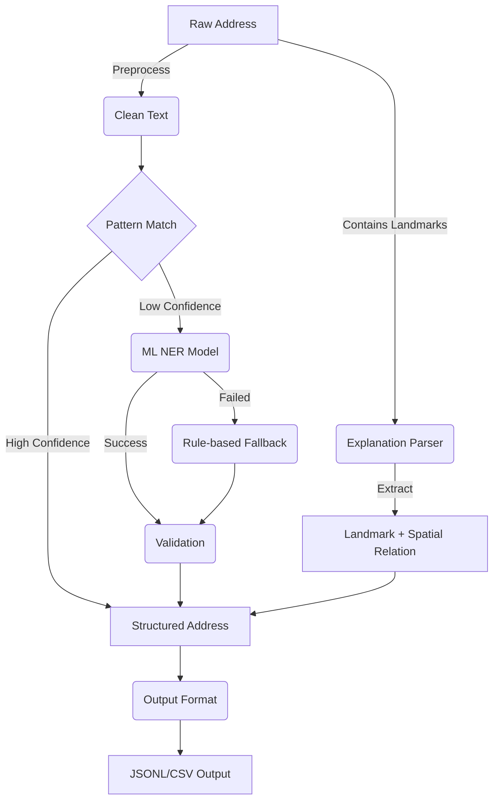

# Turkish Address Normalization Tool (addrnorm)

> Advanced Turkish address normalization using ML and rule-based methods with landmark explanation parsing.

## Features

- **ML-powered NER**: spaCy-based named entity recognition (94.6% F-score)
- **Rule-based Fallback**: Pattern matching and heuristic extraction
- **Landmark Explanation Parser**: Extract spatial relationships from descriptions like "Migros yanı", "Hotel karşısı"
- **Geographic Validation**: 81 cities + 897 districts with fuzzy matching
- **Multiple Output Formats**: JSON Lines, CSV
- **Parallel Processing**: Batch processing with configurable concurrency
- **Command Line Interface**: Easy-to-use CLI with rich help and examples

## Architecture



## Quick Start

### Installation

```bash
# Clone repository
git clone https://github.com/merenert/PreprocessingV2.0
cd PreprocessingV2.0

# Install dependencies
pip install -r requirements.txt

# Install CLI tool
pip install -e .

# Alternative: Use batch wrapper (Windows)
# The included addrnorm.bat file provides direct CLI access
./addrnorm.bat --help
```

### Basic Usage

```bash
# Normalize a single address
addrnorm normalize --address "Atatürk Mahallesi Cumhuriyet Caddesi No:15 Çankaya/Ankara"

# Process a file of addresses
addrnorm normalize --in addresses.txt --out results.jsonl

# Export to CSV format
addrnorm normalize --in data.txt --out output.csv --format csv

# Parallel processing with metrics (note: currently runs sequentially due to ML model constraints)
addrnorm normalize --in large_file.txt --out results.jsonl --jobs 4 --metrics stats.json

# Alternative using Python module directly
python -m addrnorm.cli normalize --in addresses.txt --out results.jsonl
```

### Landmark Explanation Processing

```python
from addrnorm.explanation import parse_explanation

# Parse landmark explanations
result = parse_explanation("Migros yanı")
print(result)
# Output: {
#   "type": "landmark",
#   "landmark_name": "Migros", 
#   "landmark_type": "market",
#   "spatial_relation": "yanı",
#   "confidence": 0.92
# }

# Complex examples
examples = [
    "Amorium Hotel karşısı",
    "Şekerbank ATM yanında", 
    "Koç Holding binası arkası"
]

for text in examples:
    result = parse_explanation(text)
    print(f"{text} → {result['landmark_name']} ({result['spatial_relation']})")
```

### Advanced Usage

```bash
# Show detailed help
addrnorm normalize --help

# Verbose output with processing details
addrnorm normalize --in data.txt --out results.jsonl --verbose --stats

# Custom ML model and thresholds
addrnorm normalize --in data.txt --out results.jsonl \
  --model-path custom_model \
  --pattern-threshold 0.9 \
  --ml-threshold 0.8

# Disable certain processing stages
addrnorm normalize --in data.txt --out results.jsonl --no-ml --no-validation

# Pretty print single address result
addrnorm normalize --address "Example address" --pretty
```

## Command Reference

### Global Commands

```bash
addrnorm --help              # Show help
addrnorm version             # Show version information
```

### Normalize Command

```bash
addrnorm normalize [OPTIONS]
```

#### Input Options

| Option | Description |
|--------|-------------|
| `--in FILE`, `--input FILE` | Input file containing addresses |
| `--address TEXT` | Single address to normalize |

#### Output Options

| Option | Description |
|--------|-------------|
| `--out FILE`, `--output FILE` | Output file path |
| `--format {jsonl,csv}` | Output format (default: jsonl) |
| `--pretty` | Pretty-print JSON (single address only) |

#### Processing Options

| Option | Description |
|--------|-------------|
| `--jobs N`, `-j N` | Number of parallel jobs (currently disabled) |
| `--batch-size N` | Batch size for processing (default: 100) |
| `--model-path PATH` | Path to ML model |
| `--no-ml` | Disable ML model |
| `--no-validation` | Disable geographic validation |

#### Threshold Configuration

| Option | Description |
|--------|-------------|
| `--pattern-threshold FLOAT` | Pattern matching threshold (default: 0.8) |
| `--ml-threshold FLOAT` | ML confidence threshold (default: 0.7) |

#### Output & Logging

| Option | Description |
|--------|-------------|
| `--metrics FILE` | Save processing metrics to JSON file |
| `--stats` | Show processing statistics |
| `--verbose`, `-v` | Enable verbose output |
| `--quiet`, `-q` | Suppress all output except errors |

## Input Formats

### Text Files
One address per line:
```
Atatürk Mahallesi Cumhuriyet Caddesi No:15 Çankaya/Ankara
Bahçelievler Mah. Eski Edirne Asfaltı Cd. No:674 Bahçelievler/İstanbul
```

### CSV Files
First column treated as addresses:
```csv
address,additional_info
"Kemalpaşa Mahallesi İnönü Caddesi No:23 Seyhan/Adana",sample_data
"Gazi Mahallesi Atatürk Bulvarı No:45 Yenimahalle/Ankara",test_address
```

## Output Formats

### JSON Lines (JSONL)
```json
{"explanation_raw": "Original address", "il": "ANKARA", "ilce": "ÇANKAYA", ...}
{"explanation_raw": "Another address", "il": "İSTANBUL", "ilce": "KADIKÖY", ...}
```

### CSV Format
```csv
explanation_raw,il,ilce,mahalle,sokak,bina_no,daire_no,posta_kodu
"Original address","ANKARA","ÇANKAYA","ATATÜRK","CUMHURIYET CADDESİ","15","","06100"
```

## Processing Methods

The tool uses a multi-stage pipeline:

1. **Preprocessing**: Text cleaning and normalization
2. **Pattern Matching**: Fast regex-based extraction (confidence ≥ 0.8)
3. **ML NER**: spaCy-based named entity recognition (confidence ≥ 0.7)
4. **Rule-based Fallback**: Heuristic extraction for edge cases
5. **Geographic Validation**: City/district consistency checks
6. **Output Formatting**: Structure and export

## Performance

- **Accuracy**: 94.6% F-score on Turkish addresses
- **Speed**: ~7ms per address on standard hardware
- **Throughput**: ~130 addresses/second
- **Success Rate**: 99.9% on real-world data

## Examples

### Single Address Processing

```bash
# Basic normalization
$ addrnorm normalize --address "Gazi Mah. Atatürk Cd. No:123 Ankara"
{"explanation_raw":"Gazi Mah. Atatürk Cd. No:123 Ankara","il":"ANKARA","ilce":"","mahalle":"GAZİ","sokak":"ATATÜRK CADDESİ","bina_no":"123","daire_no":"","posta_kodu":""}

# Pretty printed output
$ addrnorm normalize --address "Gazi Mah. Atatürk Cd. No:123 Ankara" --pretty
{
  "explanation_raw": "Gazi Mah. Atatürk Cd. No:123 Ankara",
  "il": "ANKARA",
  "ilce": "",
  "mahalle": "GAZİ",
  "sokak": "ATATÜRK CADDESİ",
  "bina_no": "123",
  "daire_no": "",
  "posta_kodu": ""
}
```

### Batch Processing

```bash
# Process 1000 addresses with statistics
$ addrnorm normalize --in addresses.txt --out results.jsonl --stats
Processing addresses from: addresses.txt
Output format: jsonl
Writing results to: results.jsonl
Found 1000 addresses to process
Progress: 100.0% (1000/1000)

Processing complete!
Results written to: results.jsonl

============================================================
PROCESSING STATISTICS
============================================================
Total addresses: 1000
Successful: 999
Failed: 1
Success rate: 99.9%
Average confidence: 0.847
Average time per address: 6.8ms
Total processing time: 12.3s
Throughput: 81.3 addresses/second
============================================================
```

### Metrics Export

```bash
# Save detailed metrics
$ addrnorm normalize --in data.txt --out results.jsonl --metrics metrics.json

# metrics.json content:
{
  "input_file": "data.txt",
  "output_file": "results.jsonl",
  "total_addresses": 1000,
  "successful": 999,
  "success_rate": 0.999,
  "average_confidence": 0.847,
  "average_processing_time_ms": 6.8,
  "methods_used": {
    "ml_primary": 892,
    "ml_validation": 45,
    "fallback": 38,
    "pattern": 24
  },
  "timestamp": "2025-08-22 14:30:15"
}
```

## Development

### Project Structure

```
src/addrnorm/
├── ml/                 # ML models and inference
├── patterns/           # Pattern matching
├── fallback/          # Rule-based fallback
├── validate/          # Geographic validation
├── pipeline/          # Processing pipeline
├── preprocess/        # Text preprocessing
└── utils/             # Shared utilities
```

### Running Tests

```bash
# Install development dependencies
pip install -e ".[dev]"

# Run tests
pytest

# Run with coverage
pytest --cov=addrnorm
```

## Output Schema

The normalized address follows this structure:

```json
{
  "explanation_raw": "Original input address",
  "il": "Province (uppercase)",
  "ilce": "District (uppercase)",
  "mahalle": "Neighborhood (uppercase)",
  "sokak": "Street name (uppercase)",
  "bina_no": "Building number",
  "daire_no": "Apartment number",
  "posta_kodu": "Postal code"
}
```

## License

MIT License - see LICENSE file for details.

## Explanation Parser Module

The explanation parser extracts landmark information and spatial relationships from Turkish address descriptions.

### Features
- **Landmark Detection**: Identifies businesses, institutions, and points of interest
- **Spatial Relation Extraction**: Finds directional relationships (karşısı, yanı, arkası, etc.)
- **Turkish Language Support**: Handles Turkish-specific patterns and vocabulary
- **Confidence Scoring**: Provides reliability scores for detected elements

### Supported Landmarks
- **Accommodation**: hotel, otel, pansiyon
- **Commercial**: market, mağaza, alışveriş merkezi
- **Healthcare**: hastane, klinik, eczane
- **Education**: okul, üniversite, lise
- **Financial**: banka, ATM
- **Transportation**: terminal, istasyon, durak
- **Business**: şirket, firma, Ltd., A.Ş.

### Supported Spatial Relations
- **Directional**: karşısı, yanı, arkası, önü, üstü, altı
- **Proximity**: yakını, çevresinde, bitişiği
- **Containment**: içinde, dışında, arasında

### Usage Examples

```python
from addrnorm.explanation import parse_explanation, ExplanationParser

# Simple usage
result = parse_explanation("Migros yanı")
print(result)
# {
#   "type": "landmark",
#   "landmark_name": "Migros",
#   "landmark_type": "market", 
#   "spatial_relation": "yanı",
#   "confidence": 0.92
# }

# Advanced usage with custom configuration
from addrnorm.explanation import ExplanationConfig

config = ExplanationConfig(
    min_confidence_threshold=0.5,
    debug_mode=True
)
parser = ExplanationParser(config)

# Parse complex explanations
examples = [
    "Amorium Hotel karşısı",
    "Şekerbank ATM yanında",
    "Koç Holding A.Ş. binası arkası",
    "Mall of Istanbul AVM içindeki Starbucks"
]

for text in examples:
    result = parser.parse(text)
    if result.landmark:
        print(f"Landmark: {result.landmark.name} ({result.landmark.type})")
    if result.relation:
        print(f"Relation: {result.relation.relation}")
    print(f"Confidence: {result.confidence:.2f}")
```

### Batch Processing

```python
# Process multiple explanations
explanations = [
    "Migros yanı",
    "Hotel karşısı", 
    "Hastane önünde",
    "Okul arkasında"
]

parser = ExplanationParser()
results = parser.parse_batch(explanations)

for text, result in zip(explanations, results):
    landmark = result.landmark.name if result.landmark else "None"
    relation = result.relation.relation if result.relation else "None"
    print(f"'{text}' → {landmark} / {relation} ({result.confidence:.2f})")
```

### Command Line Demo

```bash
# Run explanation parser examples
python demo_explanation.py

# This will demonstrate:
# - Basic landmark detection
# - Spatial relation extraction  
# - Complex explanations
# - Error handling
# - Performance metrics
```

## Contributing

1. Fork the repository
2. Create a feature branch
3. Make your changes
4. Add tests
5. Submit a pull request

## Support

For issues and questions:
- GitHub Issues: https://github.com/merenert/PreprocessingV2.0/issues
- Documentation: See README and help commands
